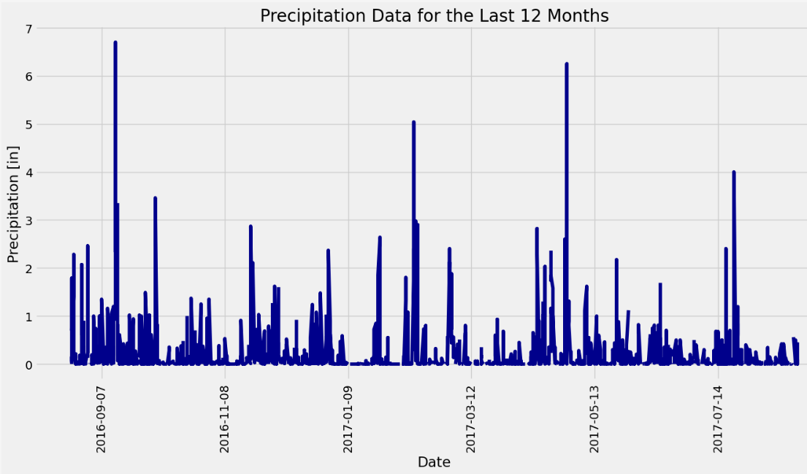
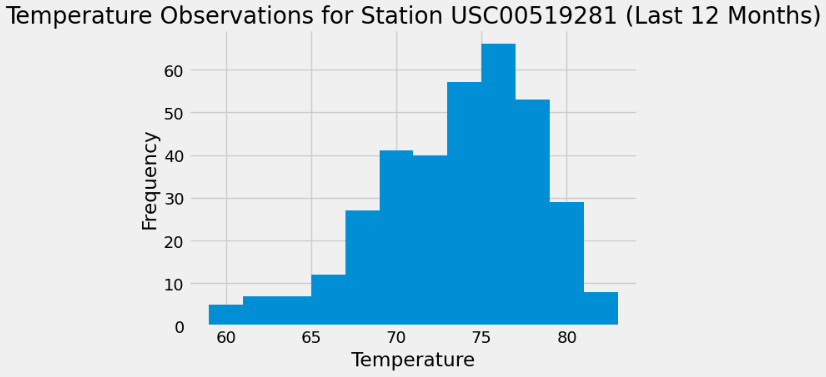

# Step-by-Step Guide to Analyzing Honolulu's Climate for Your Dream Vacation

## Overview of the Analysis

This project involves applying Python and SQLAlchemy for basic climate analysis and data exploration of a climate database. The initial task required utilizing SQLAlchemy ORM queries to conduct a thorough analysis, with the support of tools such as Pandas and Matplotlib to uncover and visualize key insights from the data. Following this analysis, the project transitioned to the development of a Flask API, which was designed based on the queries created during the analysis phase. This API was developed to provide streamlined access to the climate data, enhancing its usability for further applications. This project integrated data analysis with API development, offering a comprehensive approach to managing and utilizing climate data.

## Results

**Precipitation Analysis**

**Station Analysis**

| Station | Count |
| ------------- |:-------------:|
| USC00519281 | 2772 | 
| USC00519397 | 2724 | 
| USC00513117 | 2709 | 
| USC00519523 | 2669 | 
| USC00516128 | 2612 | 
| USC00514830 | 2202 | 
| USC00511918 | 1979 |  
| USC00517948 | 1372 | 
| USC00518838 | 511 | 

**Most Active Station Temperature Analysis**

| Most Active Station: USC00519281 | Data |  
| Lowest Temperature | 54.00 F |
| Highest Temperature | 85.00 F|
| Average Temperature | 71.66 F |

 
 ## Climate App 

API Static Routes:
* Precipitation route
* Stations route
* Tobs route (temperature observation data)
  
API Dynamic Routes
* Start route (accepts the start date as a parameter from the URL--> returns the min, max, and average temperatures calculated from the given start date to the end of the dataset)
* Start/end route (accepts the start and end dates as parameters from the URL --> returns the min, max, and average temperatures calculated from the given start date to the given end date)
